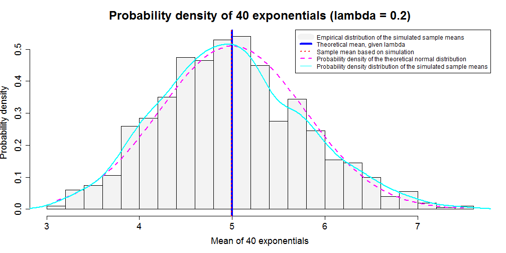

simAppCoursera's Anatomy
========================================================
author: Qian Fu
date: 27 December 2015
font-family: Cambria
transition: rotate

Developing Data Products - Assignment (part 2)

<small>
- Shinyapps.io: https://mikeqfu.shinyapps.io/simAppCoursera
- Github: https://github.com/mikeqfu/simAppCoursera.git
</small>

Introduction
========================================================
This presentation is intended to briefly 'decode' how the simple Shiny application, [simAppCoursera](https://mikeqfu.shinyapps.io/simAppCoursera), works. The app was:

- created for the first part of the course project of a Coursera course, [Developing Data Products](https://www.coursera.org/learn/data-products);  
- deployed deployed on the RStudio's server (i.e. shinyapps.io); 
- illustrating the basic properties of the distribution of the mean of [exponentials](https://en.wikipedia.org/wiki/Exponential_distribution) via simulation; *and* 
- comparing the exponential distribution with the [Central Limit Theorem](https://en.wikipedia.org/wiki/Central_limit_theorem)

<small>
For more information, see the "simulation exercise" of another Coursera course - [Statistical Inference](https://www.coursera.org/learn/statistical-inference). 
</small>


Simulation
========================================================
<small>
Given default values specified in the app, the simulation is performanced as follows:
</small>


```r
# rate parameter of exponential distribution
lambda <- 0.2
# number of simulations
noSim <- 1000
# sample size for each simulation
n <- 40
# seed number
set.seed(1)   

# means of the simulated samples
mes <- NULL
for (i in 1:noSim) {
    mes <- c(mes, mean(rexp(n, lambda)))
}
```


Distributions
========================================================

 

<small><small>
Some parameters, including the **exponential rate** (`lambda`), **nmber of simulations** (`noSim`), **sample size for each simulation** (`n`), as well as the **number of cells** (`cellNumber`) for the empirical distribution, could be manually changed on the app page.
</small></small>


Brief summary
========================================================
- The app illustrates
    - the density of **simulated** sample means of the specified exponential distribution, given a rate parameter (being 0.2 in the example); and 
    - the **theoretical** probability density of a normal distribution with the corresponding mean and standard deviation (being 5 and 0.78, respectively, in the example).

- The comparison between the simulated distribution and the corresponding theoretical normal distribution demonstrates the *central limit theorem*.

